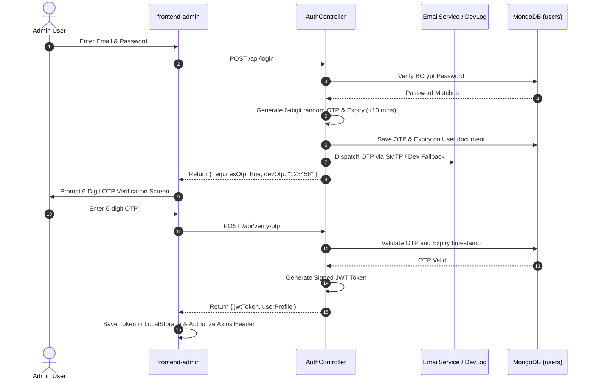
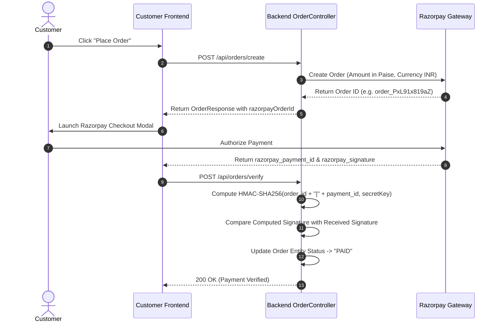

# 🏛️ Technical Architecture & System Design Specification

This document presents the technical architecture, component design, data flows, security mechanisms, and API specifications for the **Food Delivery System**.

---

## 📐 High-Level Component Architecture

The application follows a **Decoupled Microservices / Monorepo Architecture** consisting of four primary modules:

```text
┌────────────────────────────────────────────────────────────────────────┐
│                          CLIENT LAYER                                  │
│                                                                        │
│   ┌──────────────────────────────┐    ┌────────────────────────────┐   │
│   │   frontend-customer (Vite)   │    │   frontend-admin (Vite)    │   │
│   │   React 19 / Context API     │    │   React 19 / Admin Portal  │   │
│   └──────────────┬───────────────┘    └─────────────┬──────────────┘   │
└──────────────────┼──────────────────────────────────┼──────────────────┘
                   │                                  │
                   ▼                                  ▼
┌────────────────────────────────────────────────────────────────────────┐
│                        REVERSE PROXY & GATEWAY                         │
│                                                                        │
│                    Nginx Container / CORS Filter                       │
└──────────────────────────────────┬─────────────────────────────────────┘
                                   │
                                   ▼
┌────────────────────────────────────────────────────────────────────────┐
│                     BACKEND APPLICATION SERVER                         │
│                                                                        │
│   ┌────────────────────────────────────────────────────────────────┐   │
│   │               Spring Boot REST Controllers                     │   │
│   │  (AuthController, FoodController, CartController, OrderCtrl)   │   │
│   └──────────────────────────────┬─────────────────────────────────┘   │
│                                  │                                     │
│   ┌──────────────────────────────▼─────────────────────────────────┐   │
│   │           Spring Security 6 & JWT Filter Chain                 │   │
│   └──────────────────────────────┬─────────────────────────────────┘   │
│                                  │                                     │
│   ┌──────────────────────────────▼─────────────────────────────────┐   │
│   │                       Service Layer                            │   │
│   │  (UserService, FoodService, CartService, OrderService, AI)     │   │
│   └──────────────────────────────┬─────────────────────────────────┘   │
└──────────────────────────────────┼─────────────────────────────────────┘
                                   │
                                   ▼
┌────────────────────────────────────────────────────────────────────────┐
│                     PERSISTENCE & CLOUD SERVICES                       │
│                                                                        │
│  ┌───────────────────────┐  ┌──────────────────┐  ┌─────────────────┐  │
│  │ MongoDB 7.0 (Spring)  │  │ Razorpay API     │  │ AWS S3 Bucket   │  │
│  └───────────────────────┘  └──────────────────┘  └─────────────────┘  │
└────────────────────────────────────────────────────────────────────────┘
```

---

## 🛠️ Complete Technology Stack Reference

### Backend Microservice (`backend/`)
- **Runtime**: Java 21 LTS (OpenJDK 21.0.6)
- **Framework**: Spring Boot `3.4.1`
- **Security**: Spring Security `6.4.2`, `jjwt` (Java JWT `0.11.5`), BCrypt (`BCryptPasswordEncoder`)
- **Database Access**: Spring Data MongoDB (`spring-boot-starter-data-mongodb`)
- **AWS S3 Integration**: `com.amazonaws:aws-java-sdk-s3:1.12.780`
- **Payment Processing**: `com.razorpay:razorpay-java:1.4.8`
- **Mail Processing**: Jakarta Mail (`jakarta.mail-api:2.1.3`)
- **Build & Dependency Management**: Apache Maven 3.9

### Customer Portal (`frontend-customer/`)
- **UI Framework**: React `19.0.0`
- **Build Tooling**: Vite `5.4.11`
- **State Management**: React Context API (`StoreContext`)
- **HTTP Client**: Axios `1.7.9` (Base URL: `http://localhost:8080/api`)
- **AI Generative Engine**: `@google/generative-ai` (`0.24.0`)
- **Form Mailer**: `@emailjs/browser` (`4.4.1`)
- **Styling**: Vanilla CSS, Bootstrap Icons (`1.11.3`)
- **Toasts**: React Toastify (`11.0.3`)

### Admin Dashboard (`frontend-admin/`)
- **UI Framework**: React `19.0.0`
- **Build Engine**: Vite `5.4.11`
- **Security**: 2FA OTP Authentication Modal & Filter
- **Routing**: React Router DOM (`6.28.1`)

---

## 🔄 Sequence Flows & Technical Workflows

### 1. Two-Factor Authentication (2FA OTP) Flow


---

### 2. Payment Gateway Verification (Razorpay HMAC-SHA256)


---

## 🔌 Core API Specifications

| Method | Endpoint | Access Level | Description |
| :--- | :--- | :--- | :--- |
| `POST` | `/api/register` | Public | Register new customer account |
| `POST` | `/api/login` | Public | Primary authentication step (Triggers OTP) |
| `POST` | `/api/verify-otp` | Public | Verify 6-digit OTP and issue JWT Token |
| `GET` | `/api/foods` | Public | Retrieve list of all food items |
| `GET` | `/api/foods/category/{category}` | Public | Filter food items by category |
| `POST` | `/api/foods/add` | Admin | Add new food item with AWS S3 image |
| `DELETE` | `/api/foods/{id}` | Admin | Delete food item from catalog and S3 |
| `GET` | `/api/cart/get` | User | Get current user's shopping cart |
| `POST` | `/api/cart/add` | User | Add item to shopping cart |
| `POST` | `/api/cart/remove` | User | Remove item from cart |
| `POST` | `/api/orders/create` | User | Create new order & Razorpay transaction |
| `POST` | `/api/orders/verify` | User | Verify Razorpay payment signature |
| `GET` | `/api/orders/user` | User | Get logged-in user order history |
| `PATCH` | `/api/orders/{id}/status` | Admin | Update order status (`Preparing`, `Out for delivery`, `Delivered`) |

---

## 🛡️ Security Controls & Engineering Practices

1. **CORS Configuration**: Explicitly configured cross-origin policy allowing `http://localhost:5173` (Customer) and `http://localhost:5174` (Admin).
2. **Stateless Sessions**: Server holds no session state. Authorization is verified per-request using `JwtAuthenticationFilter`.
3. **Safe Fallbacks**: Dev mode fallbacks for offline SMTP email delivery and sandbox Razorpay authentication ensure maximum developer velocity without compromising code structure.
