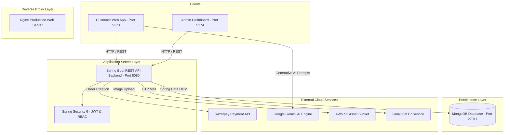
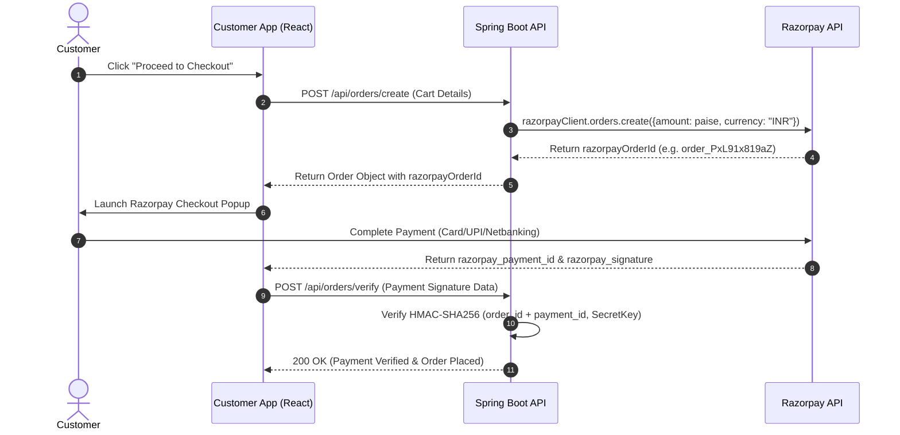

# 🍔 Food Delivery System — Enterprise Full-Stack Microservices Architecture

[](https://spring.io/projects/spring-boot)
[](https://www.oracle.com/java/)
[](https://react.dev/)
[](https://vitejs.dev/)
[](https://www.mongodb.com/)
[](https://www.docker.com/)

A modern, production-grade, enterprise food delivery platform built with **Spring Boot 3.4**, **MongoDB**, **React 19**, **Razorpay Payment Gateway**, **Google Gemini AI Assistant**, and **Docker Containerization**.

---

## 📋 Table of Contents
- [🌟 Key System Features](#-key-system-features)
- [🛠️ Detailed Technology Stack](#️-detailed-technology-stack)
- [🏛️ System Architecture Overview](#️-system-architecture-overview)
- [📁 Repository Monorepo Structure](#-repository-monorepo-structure)
- [🗄️ Database Schemas & Data Models](#️-database-schemas--data-models)
- [🔑 Security & Authentication Architecture](#-security--authentication-architecture)
- [🤖 AI Chatbot Architecture (Foodie Bot)](#-ai-chatbot-architecture-foodie-bot)
- [💳 Payment Gateway Integration (Razorpay)](#-payment-gateway-integration-razorpay)
- [⚡ Quick Start & Installation Guide](#-quick-start--installation-guide)
- [🐳 Docker & Cloud Deployment](#-docker--cloud-deployment)

---

## 🌟 Key System Features

- 🛒 **Customer Web Portal (`frontend-customer`)**:
  - Dynamic food catalog with 70 pre-seeded items across 7 categories (Biryani, Burger, Cake, Ice cream, Pizza, Rolls, Salad).
  - Responsive shopping cart & real-time price calculation.
  - Razorpay payment checkout integration with HMAC-SHA256 signature verification.
  - Interactive **Foodie Bot** powered by **Google Gemini AI** for smart meal recommendations.
  - Customer 2FA OTP login & real-time order tracking dashboard.

- 🛡️ **Admin Management Control Panel (`frontend-admin`)**:
  - Secure two-factor authentication (2FA OTP verification).
  - Food menu management (Add, Delete, Update food items with AWS S3 image uploads).
  - Real-time order status management workflow (`Preparing` -> `Out for delivery` -> `Delivered`).

- ⚡ **Backend REST API Microservice (`backend`)**:
  - Built on **Spring Boot 3.4** and **Java 21**.
  - Stateless **JWT (JSON Web Token)** security with Spring Security 6.
  - MongoDB integration using Spring Data MongoDB Repositories.
  - AWS S3 integration for cloud asset storage.
  - Dev fallback mechanisms for SMTP and Razorpay sandbox testing.

---

## 🛠️ Detailed Technology Stack

### 1. Backend API Layer
| Component | Technology / Library | Description |
| :--- | :--- | :--- |
| **Language & Runtime** | Java 21 LTS | High-performance JDK 21 runtime with virtual threads support |
| **Framework** | Spring Boot 3.4.1 | Production-ready RESTful web service framework |
| **Security** | Spring Security 6 + JWT | Stateless authentication & Role-Based Access Control (RBAC) |
| **Data Persistence** | Spring Data MongoDB | Spring ODM repository layer mapping to MongoDB 7.0 |
| **Payment Gateway** | Razorpay Java SDK (`com.razorpay:razorpay-java:1.4.8`) | Server-side Razorpay order creation & signature verification |
| **Cloud Storage** | AWS SDK S3 (`com.amazonaws:aws-java-sdk-s3:1.12.780`) | Cloud bucket management for food item images |
| **Email Services** | Jakarta Mail + Spring Boot Starter Mail | Automated OTP dispatch & transaction notifications |
| **Code Boilerplate** | Project Lombok | Annotation-driven getters, setters, builders, and constructors |

### 2. Frontend Customer Application (`frontend-customer`)
| Component | Technology / Library | Description |
| :--- | :--- | :--- |
| **UI Framework** | React 19 | Component-driven declarative user interface |
| **Build System** | Vite 5 | Instant HMR development server & optimized productionbundler |
| **Routing** | React Router DOM v6 | Client-side page navigation & route protection |
| **HTTP Client** | Axios | Interceptor-backed HTTP client for backend REST communication |
| **State Management** | React Context API | Global state management for authentication tokens and cart state |
| **AI Assistant** | `@google/generative-ai` | Integration with Gemini API (`gemini-1.5-flash`) |
| **Styling** | Vanilla CSS + Bootstrap 5 Icons | Responsive glassmorphism UI & modern design system |
| **Notifications** | React Toastify | Real-time toast notifications for user interactions |

### 3. Frontend Admin Application (`frontend-admin`)
| Component | Technology / Library | Description |
| :--- | :--- | :--- |
| **UI Framework** | React 19 | Admin dashboard UI |
| **Build Tool** | Vite 5 | Rapid bundle optimization |
| **State & Auth** | Context API + LocalStorage | Admin session & token management |
| **Security** | 2FA OTP Verification | Two-factor verification for admin panel access |

### 4. Database & Infrastructure
| Component | Technology / Library | Description |
| :--- | :--- | :--- |
| **Database** | MongoDB 7.0 | High-performance document database |
| **Web Server / Proxy**| Nginx Alpine | Production reverse proxy serving static React bundles |
| **Containerization** | Docker & Docker Compose | Multi-stage Docker container build and orchestration |

---

## 🏛️ System Architecture Overview



---

## 📁 Repository Monorepo Structure

```text
Food Delivery app/
├── backend/                    # Spring Boot REST API Microservice (Java 21)
│   ├── src/main/java/          # Controllers, Entities, Services, Repositories, Filters
│   ├── src/main/resources/     # application.properties configuration
│   ├── pom.xml                 # Maven dependency manifest
│   └── Dockerfile              # JDK 21 Multi-stage Dockerfile
├── frontend-customer/          # React + Vite Customer Web Application
│   ├── src/Pages/              # Home, ExploreFood, Cart, PlaceOrder, MyOrders, Contact
│   ├── src/components/         # FoodieBot, Menubar, Login, Register, FoodDisplay
│   ├── src/service/            # aiService.js, authService.js, apiClient.js
│   ├── nginx.conf              # Production Nginx reverse proxy configuration
│   └── Dockerfile              # Node 20 build -> Nginx Alpine image
├── frontend-admin/             # React + Vite Admin Control Panel
│   ├── src/pages/              # AddFood, ListFood, Orders, Login (2FA)
│   └── Dockerfile              # Admin Docker build configuration
├── db/                         # MongoDB Database Scripts
│   ├── seed.js                 # Dataset seeder (70 items across 7 categories)
│   └── package.json            # Node MongoDB script runner
├── docker-compose.yml          # Production Docker Orchestration Blueprint
├── ARCHITECTURE.md             # Detailed Technical Architecture Specifications
├── DEPLOYMENT.md               # Cloud Deployment & Infrastructure Guide
└── README.md                   # Primary Documentation
```

---

## 🗄️ Database Schemas & Data Models

### 1. `UserEntity` (`users` collection)
```json
{
  "_id": "ObjectId",
  "name": "Abhishek",
  "email": "abhishek8dev@gmail.com",
  "password": "$2b$10$BCryptHashedPasswordString",
  "role": "ROLE_USER",
  "otp": "481920",
  "otpExpiry": "ISODate"
}
```

### 2. `FoodEntity` (`foods` collection)
```json
{
  "_id": "ObjectId",
  "name": "Hyderabadi Dum Biryani",
  "description": "Authentic aromatic basmati rice cooked with tender chicken.",
  "price": 290.00,
  "category": "Biryani",
  "imageUrl": "https://images.unsplash.com/photo-1563379091339-03b21ab4a4f8"
}
```

### 3. `OrderEntity` (`orders` collection)
```json
{
  "_id": "ObjectId",
  "userId": "6aa548a84410fa10bef462e6",
  "userEmail": "abhishek8dev@gmail.com",
  "items": [
    {
      "foodId": "6aa54b4ad077523a436e56a8",
      "name": "Hyderabadi Dum Biryani",
      "price": 290.00,
      "quantity": 2
    }
  ],
  "amount": 580.00,
  "paymentStatus": "PAID",
  "orderStatus": "Preparing",
  "razorpayOrderId": "order_PxL91x819aZ",
  "razorpayPaymentId": "pay_PxL99aK10zB",
  "razorpaySignature": "9f8a7b6c...",
  "createdAt": "ISODate"
}
```

---

## 🔑 Security & Authentication Architecture

1. **Password Hashing**: Passwords stored using Spring Security's `BCryptPasswordEncoder` with salt round 10.
2. **Stateless JWT Tokens**: Upon successful 2FA authentication, backend issues a signed JWT containing username and roles.
3. **Filter Chain (`JwtAuthenticationFilter`)**: Intercepts incoming HTTP requests, validates `Authorization: Bearer <JWT>`, and sets Spring Security Context.
4. **Admin 2FA Verification**: Admin authentication requires email/password submission followed by temporary 6-digit OTP verification.

---

## 💳 Payment Gateway Integration (Razorpay)



---

## ⚡ Quick Start & Installation Guide

### Prerequisites
- **Java 21 LTS**
- **Node.js 20+**
- **MongoDB 7.0+**

### 1. Seed MongoDB Database (70 Items)
```bash
cd db
npm install
node seed.js
```

### 2. Start Backend API
```bash
cd backend
./mvnw spring-boot:run
```
*API accessible at `http://localhost:8080`*

### 3. Start Customer App
```bash
cd frontend-customer
npm install
npm run dev
```
*Customer App running at `http://localhost:5173`*

### 4. Start Admin Dashboard
```bash
cd frontend-admin
npm install
npm run dev
```
*Admin Panel running at `http://localhost:5174`*

---

## 🐳 Docker Deployment

To build and run all 4 containers (MongoDB, Backend, Customer App, Admin App):
```bash
docker compose up -d --build
```

For complete architecture specifications, see [ARCHITECTURE.md](./ARCHITECTURE.md). For detailed deployment instructions, see [DEPLOYMENT.md](./DEPLOYMENT.md).
